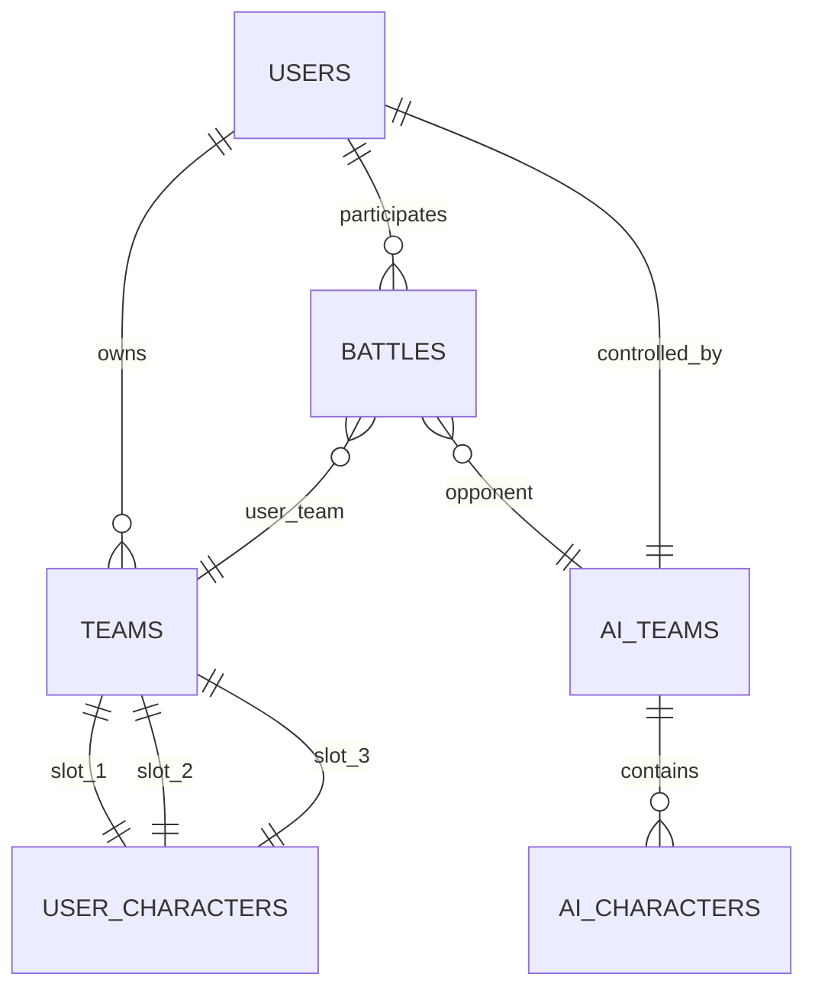

# Blank Wars Battle System - Complete Documentation

**Version**: 2.0 (3v3 Team-Based Architecture)  
**Last Updated**: November 25, 2024  
**Status**: Production Ready

---

## Table of Contents

1. [System Overview](#system-overview)
2. [Architecture & Design](#architecture--design)
3. [Team Management](#team-management)
4. [Battle Flow (End-to-End)](#battle-flow-end-to-end)
5. [PVE vs PVP Modes](#pve-vs-pvp-modes)
6. [Gameplan Adherence System](#gameplan-adherence-system)
7. [Database Schema](#database-schema)
8. [Code Structure](#code-structure)
9. [Recent Implementation Work](#recent-implementation-work)
10. [API Reference](#api-reference)

---

## System Overview

### What is the Battle System?

The Blank Wars Battle System is a **3v3 turn-based tactical combat system** where teams of 3 characters face off on a hexagonal grid. The system supports both:
- **PVE (Player vs Environment)**: Players battle against AI-controlled teams
- **PVP (Player vs Player)**: Players battle against other players' teams

### Core Features

- **3v3 Team Combat**: Each side fields a team of 3 characters
- **Hexagonal Grid**: Tactical positioning on a hex-based battlefield
- **Turn-Based Combat**: Initiative-based turn order using character speed
- **Team-Based Architecture**: Battles track entire teams, not individual characters
- **Gameplan Adherence**: Characters follow (or deviate from) coach strategies based on trust/adherence levels
- **Psychology Integration**: Team chemistry, coaching points, and mental state affect battle outcomes

### Design Philosophy

**"Fail Fast, Find, Fix"** - No shortcuts, no fallbacks, strict validation
- All data must exist before battle creation
- No `any` types - strict TypeScript interfaces
- No nullable character IDs in team-based battles
- Comprehensive error handling with clear feedback

---

## Architecture & Design

### High-Level Architecture

```
┌─────────────────────────────────────────────────────────────┐
│                    Battle Request                            │
│              (User clicks "Find Match")                      │
└────────────────────┬────────────────────────────────────────┘
                     │
                     ▼
┌─────────────────────────────────────────────────────────────┐
│              find_match(user_id, mode)                       │
│  ┌──────────────────────────────────────────────────────┐  │
│  │ 1. Load user's active team (3 characters)            │  │
│  │ 2. Validate team completeness                        │  │
│  │ 3. Apply HQ bonuses to all characters                │  │
│  │ 4. Create QueueEntry with team_characters[]          │  │
│  └──────────────────────────────────────────────────────┘  │
└────────────────────┬────────────────────────────────────────┘
                     │
          ┌──────────┴──────────┐
          │                     │
      PVE Mode              PVP Mode
          │                     │
          ▼                     ▼
┌──────────────────┐  ┌──────────────────┐
│find_pve_opponent │  │ search_for_match │
│                  │  │                  │
│ • Load AI team   │  │ • Redis queue    │
│ • 3 AI chars     │  │ • Rating match   │
│ • Return Queue   │  │ • Find opponent  │
│   Entry          │  │ • Lock mechanism │
└────────┬─────────┘  └────────┬─────────┘
         │                     │
         └──────────┬──────────┘
                    │
                    ▼
┌─────────────────────────────────────────────────────────────┐
│              create_battle(user, opponent)                   │
│  ┌──────────────────────────────────────────────────────┐  │
│  │ 1. Store teams in battle.user_team_data (JSONB)      │  │
│  │ 2. Store teams in battle.opponent_team_data (JSONB)  │  │
│  │ 3. Set individual char IDs to null (team-based)      │  │
│  │ 4. Initialize hex_grid_state                         │  │
│  └──────────────────────────────────────────────────────┘  │
└────────────────────┬────────────────────────────────────────┘
                     │
                     ▼
┌─────────────────────────────────────────────────────────────┐
│        initialize_hex_grid_battle(battle, user, opp)         │
│  ┌──────────────────────────────────────────────────────┐  │
│  │ 1. Position 3 user characters (left side)            │  │
│  │ 2. Position 3 opponent characters (right side)       │  │
│  │ 3. Calculate turn order (6 chars by speed)           │  │
│  │ 4. Initialize action states for all 6               │  │
│  └──────────────────────────────────────────────────────┘  │
└────────────────────┬────────────────────────────────────────┘
                     │
                     ▼
┌─────────────────────────────────────────────────────────────┐
│                   Battle State Created                       │
│             (Frontend receives battle_id)                    │
└─────────────────────────────────────────────────────────────┘
```

### Key Data Structures

#### QueueEntry (Matchmaking Queue)
```typescript
interface QueueEntry {
  user_id: string;
  team_characters: BattleCharacter[];  // ✅ Array of 3
  mode: 'pvp' | 'pve';
  rating: number;
  timestamp: number;
  ai_team_id?: string;      // For PVE: AI team identifier
  user_team_id?: string;    // User's team DB record ID
}
```

#### BattleCharacter (Character in Battle)
```typescript
interface BattleCharacter {
  id: string;
  user_id: string;
  character_id: string;     // Canonical character template ID
  name: string;
  title: string;
  archetype: string;
  level: number;
  
  // Stats
  current_health: number;
  max_health: number;
  current_attack: number;
  current_defense: number;
  speed: number;
  
  // Equipment
  equipped_powers?: any[];
  equipped_spells?: any[];
  equipment?: any[];
  
  // Abilities
  abilities: any[];
  
  // Other
  avatar?: string;
  gameplan_adherence?: number;  // 0-100, affects strategy following
}
```

#### Battle Database Record
```typescript
{
  id: string;                          // battle_TIMESTAMP_RANDOM
  user_id: string;
  opponent_user_id: string | null;    // null for PVE
  
  // Team-based tracking (3v3)
  user_team_data: {                   // JSONB
    characters: BattleCharacter[]     // Exactly 3
  };
  opponent_team_data: {               // JSONB
    characters: BattleCharacter[]     // Exactly 3
  };
  
  // Individual character IDs (null for 3v3)
  user_character_id: null;
  opponent_character_id: null;
  opponent_ai_character_id: null;
  
  // AI tracking
  opponent_ai_coach_id: string | null;
  opponent_ai_team_id: string | null;
  
  // Hex grid state
  hex_grid_state: {
    character_positions: Record<string, HexPosition>;
    action_states: Record<string, ActionState>;
    turn_order: string[];             // Array of character IDs
    current_turn_index: number;
  };
  
  // Battle metadata
  battle_type: 'ranked' | 'casual' | 'tournament';
  status: 'active' | 'completed' | 'abandoned';
  winner_user_id: string | null;
  // ... other fields
}
```

---

## Team Management

### How Teams Are Created

#### 1. Backend Team Storage

Teams are stored in the `teams` table:

```sql
CREATE TABLE teams (
  id TEXT PRIMARY KEY,
  user_id TEXT NOT NULL REFERENCES users(id),
  team_name TEXT,
  character_slot_1 TEXT REFERENCES user_characters(id),  -- Required
  character_slot_2 TEXT REFERENCES user_characters(id),  -- Required
  character_slot_3 TEXT REFERENCES user_characters(id),  -- Required
  is_active BOOLEAN DEFAULT true,
  created_at TIMESTAMP DEFAULT NOW(),
  updated_at TIMESTAMP DEFAULT NOW()
);
```

**Validation Rules**:
- User must have exactly 3 characters assigned
- All 3 slots must be filled before battle
- Only one team can be active per user at a time

#### 2. Loading Teams for Battle

**User Team Loading** (`find_match`):
```typescript
// 1. Query teams table for active team
const teamResult = await db_adapter.query(`
  SELECT t.id as team_id, t.character_slot_1, t.character_slot_2, t.character_slot_3
  FROM teams t
  WHERE t.user_id = $1 AND t.is_active = true
  LIMIT 1
`, [user_id]);

// 2. Validate team completeness
const characterSlots = [
  team.character_slot_1,
  team.character_slot_2,
  team.character_slot_3
].filter(Boolean);

if (characterSlots.length !== 3) {
  throw new Error(`Team incomplete. You have ${characterSlots.length}/3 characters.`);
}

// 3. Load all 3 characters with full stats
const team_characters: BattleCharacter[] = [];
for (const char_id of characterSlots) {
  const charData = await load_character_with_bonuses(char_id);
  team_characters.push(charData);
}

// 4. Apply HQ bonuses (team-wide buffs from headquarters upgrades)
const hq_bonuses = await load_hq_bonuses(user_id);
team_characters.forEach(char => apply_bonuses(char, hq_bonuses));
```

**AI Team Loading** (`find_pve_opponent`):
```typescript
// 1. Select random AI team
const aiTeamResult = await db_adapter.query(`
  SELECT * FROM ai_teams 
  WHERE is_active = true 
  ORDER BY RANDOM() 
  LIMIT 1
`);

// 2. Load all 3 AI characters for that team
const charsResult = await db_adapter.query(`
  SELECT ac.*, c.name, c.title, c.archetype
  FROM ai_characters ac
  JOIN characters c ON ac.character_id = c.id
  WHERE ac.team_id = $1
  ORDER BY ac.id
`, [aiTeam.id]);

// 3. Map to BattleCharacter[]
const team_characters: BattleCharacter[] = charsResult.rows.map(char => ({
  id: char.id,           // AI character instance ID
  user_id: aiTeam.coach_id,
  character_id: char.character_id,
  name: char.name,
  // ... all stats
}));
```

### Team Composition Strategies

Teams can be built with various archetypes:
- **Tank + DPS + Support**: Classic balanced composition
- **3 Tanks**: High defense, wear down opponents
- **3 DPS**: Glass cannon, high damage output
- **Mixed Specialists**: Utility-focused with crowd control

---

## Battle Flow (End-to-End)

### Phase 1: Matchmaking

#### Client Request
```typescript
// Frontend sends matchmaking request
socket.emit('find_match', {
  character_id: 'user_char_1_id',  // Legacy field (ignored in 3v3)
  mode: 'pve'  // or 'pvp'
});
```

#### Server Processing

**Step 1**: Load user's team
```typescript
const queue_entry = await find_match(user_id, 'pve');
// Returns QueueEntry with team_characters: [char1, char2, char3]
```

**Step 2**: Find opponent
```typescript
if (mode === 'pve') {
  opponent = await find_pve_opponent(queue_entry);
} else {
  opponent = await search_for_match_pvp(queue_entry);
}
```

**Step 3**: Create battle
```typescript
const battle = await create_battle(queue_entry, opponent);
```

### Phase 2: Battle Initialization

#### Grid Setup

**Character Positioning**:
```typescript
// User team: Left side (q=2)
const user_positions: HexPosition[] = [
  { q: 2, r: 4, s: -6 },  // Front
  { q: 2, r: 5, s: -7 },  // Mid
  { q: 2, r: 6, s: -8 }   // Back
];

// Opponent team: Right side (q=9)
const opponent_positions: HexPosition[] = [
  { q: 9, r: 4, s: -13 },  // Front
  { q: 9, r: 5, s: -14 },  // Mid
  { q: 9, r: 6, s: -15 }   // Back
];
```

**Turn Order Calculation**:
```typescript
// Combine all 6 characters
const all_characters = [
  ...user.team_characters,
  ...opponent.team_characters
];

// Sort by speed (descending - fastest first)
const turn_order = all_characters
  .sort((a, b) => (b.speed || 0) - (a.speed || 0))
  .map(c => c.id);

// Result: ['char_5', 'char_2', 'char_1', 'char_6', 'char_4', 'char_3']
```

### Phase 3: Combat Loop

**Turn Execution**:
1. Get current character from turn_order
2. Check if character is alive (health > 0)
3. If alive, execute their turn:
   - Select target (based on strategy/adherence)
   - Execute attack/ability
   - Apply damage/effects
   - Update battle state
4. Move to next character in turn_order
5. Repeat until victory condition met

**Victory Conditions**:
- All 3 enemy characters defeated (health <= 0)
- Surrender
- Timeout (if battle takes too long)

### Phase 4: Battle Resolution

```typescript
// Determine winner
const user_alive = user_team_data.characters.filter(c => c.current_health > 0);
const opp_alive = opponent_team_data.characters.filter(c => c.current_health > 0);

if (user_alive.length === 0) {
  winner = opponent.user_id;
} else if (opp_alive.length === 0) {
  winner = user.user_id;
}

// Update battle record
await update_battle_result(battle_id, {
  status: 'completed',
  winner_user_id: winner,
  // ... stats, rewards, etc.
});

// Award rewards, update rankings, etc.
```

---

## PVE vs PVP Modes

### PVE (Player vs Environment)

**Characteristics**:
- Opponent is an AI-controlled team
- AI teams stored in `ai_teams` and `ai_characters` tables
- AI has a "coach" (system user) that controls the team
- Typically easier than PVP for training/practice

**Opponent Selection**:
```typescript
async find_pve_opponent(user: QueueEntry): Promise<QueueEntry> {
  // 1. Find suitable AI team (could be rating-based in future)
  const aiTeam = await select_random_ai_team();
  
  // 2. Load all 3 AI characters
  const ai_characters = await load_ai_team_characters(aiTeam.id);
  
  // 3. Return as QueueEntry
  return {
    user_id: aiTeam.coach_id,  // System AI user
    team_characters: ai_characters,
    mode: 'pve',
    rating: aiTeam.rating || 1000,
    timestamp: Date.now(),
    ai_team_id: aiTeam.id
  };
}
```

**Database Storage**:
```typescript
{
  opponent_user_id: null,              // No real user
  opponent_ai_coach_id: 'ai_coach_1',  // System user controlling AI
  opponent_ai_team_id: 'ai_team_abc',  // AI team ID
  opponent_ai_character_id: null,      // Null in 3v3
  opponent_team_data: {
    characters: [ai_char_1, ai_char_2, ai_char_3]
  }
}
```

### PVP (Player vs Player)

**Characteristics**:
- Opponent is another real player's team
- Matchmaking based on rating (ELO-style)
- Uses Redis for distributed matchmaking across servers
- Competitive, affects rankings

**Matchmaking Process**:
```typescript
async search_for_match_pvp(queue_entry: QueueEntry): Promise<QueueEntry> {
  // 1. Add to Redis queue
  await add_to_distributed_queue(queue_entry);
  
  // 2. Search for opponent in queue
  const queue_users = await cache.getMatchmakingQueue(queue_entry.mode);
  
  for (const user of queue_users) {
    // Skip self
    if (user.id === queue_entry.user_id) continue;
    
    // Check rating difference
    const rating_diff = Math.abs(queue_entry.rating - user.data.rating);
    const wait_time = Date.now() - queue_entry.timestamp;
    const max_rating_diff = Math.min(200 + wait_time / 1000, 500);
    
    if (rating_diff <= max_rating_diff) {
      // Found match! Use distributed lock to prevent race conditions
      const lock = await acquire_match_lock(queue_entry.user_id, user.id);
      if (lock) {
        // Deserialize opponent team from Redis
        const opponent: QueueEntry = {
          user_id: user.id,
          team_characters: user.data.team_characters,
          rating: user.data.rating,
          timestamp: user.data.timestamp,
          mode: user.data.mode,
          user_team_id: user.data.user_team_id
        };
        
        // Remove both from queue
        await remove_from_distributed_queue(queue_entry.user_id);
        await remove_from_distributed_queue(opponent.user_id);
        
        return opponent;
      }
    }
  }
  
  // No match found yet
  return null;
}
```

**Database Storage**:
```typescript
{
  opponent_user_id: 'real_user_123',   // Real player
  opponent_ai_coach_id: null,          // Not AI battle
  opponent_ai_team_id: null,           // Not AI battle
  opponent_ai_character_id: null,      // Null in 3v3
  opponent_team_data: {
    characters: [player_char_1, player_char_2, player_char_3]
  }
}
```

### Comparison Table

| Feature | PVE | PVP |
|---------|-----|-----|
| Opponent | AI Team | Real Player Team |
| Difficulty | Configurable | Skill-based |
| Matchmaking | Instant | Queue-based |
| Rating Impact | Minimal | Full ELO rating |
| Rewards | Standard | Competitive bonuses |
| Opponent Source | `ai_teams` table | `teams` table |
| Offline Play | Possible | Requires both online |

---

## Gameplan Adherence System

### Overview

The **Gameplan Adherence System** measures how well characters follow their coach's strategic instructions during battle. This creates a psychology-based layer where coaching effectiveness impacts combat outcomes.

### Core Concept

```
High Adherence (90-100%) → Character strictly follows coach's strategy
Medium Adherence (50-89%) → Character mostly follows with occasional deviation  
Low Adherence (0-49%) → Character often ignores coach, makes own decisions
```

### How It Works in Battle

#### 1. Character Adherence Score

Each character has a `gameplan_adherence` field (0-100):

```typescript
interface BattleCharacter {
  // ... other fields
  gameplan_adherence: number;  // 0-100
}
```

**Factors affecting adherence**:
- **Coach-Character Relationship**: Bond level, trust
- **Character Personality**: Some characters are naturally more independent
- **Recent Performance**: Winning streaks increase adherence
- **Coaching Points**: Spent during battle to influence decisions

#### 2. Strategy Selection

During each character's turn:

```typescript
function selectAction(character: BattleCharacter, gameplan: Strategy) {
  const adherence_roll = Math.random() * 100;
  
  if (adherence_roll < character.gameplan_adherence) {
    // FOLLOW GAMEPLAN
    return executeGameplan(character, gameplan);
  } else {
    // DEVIATE - character makes own choice
    return makeIndependentDecision(character);
  }
}
```

**Example Scenarios**:

**High Adherence (95%)**:
```
Coach's Gameplan: "Focus fire on enemy tank"
Character Action: Attacks enemy tank (19/20 turns)
Deviation: Might heal ally if critically low (1/20 turns)
```

**Low Adherence (30%)**:
```
Coach's Gameplan: "Focus fire on enemy tank"
Character Action: Ignores gameplan, attacks squishy targets (70% of turns)
Coach's Intent: Often disregarded
```

#### 3. Dynamic Adherence Changes

Adherence can change mid-battle based on events:

```typescript
// Character takes critical damage
if (character.current_health < character.max_health * 0.2) {
  character.gameplan_adherence -= 10;  // Panic, less likely to follow plan
}

// Team is winning
if (team_health_advantage > 50%) {
  character.gameplan_adherence += 5;   // Confidence in coach's strategy
}

// Coach uses Coaching Point
if (coach_uses_intervention()) {
  character.gameplan_adherence += 15;  // Temporary boost
}
```

### Integration with Equipment/Powers

**Equipment Adherence Flow**:

The equipment system has a separate adherence metric that feeds into gameplan adherence:

```typescript
// From EquipmentManager component
adherence_score: number;  // Equipment-specific adherence (0-100)
bond_level: number;       // Coach-character bond (0-100)

// These affect:
// 1. Equipment effectiveness bonuses
// 2. Unlock of advanced equipment
// 3. Overall gameplan_adherence in battle
```

**Cross-System Impact**:
```
High Equipment Adherence (95%) + High Bond (90%)
  ↓
Higher overall gameplan_adherence in battle (92%)
  ↓
More consistent strategy execution
  ↓
Better battle outcomes
```

### PVE vs PVP Adherence Differences

**PVE**:
- AI opponents have fixed adherence scores
- Player's adherence matters more (less randomness)
- Easier to test strategies with predictable AI

**PVP**:
- Both teams have adherence randomness
- Meta-game: Build team with high-adherence characters
- Coaching Points become crucial resource
- Psychological edge: Predict opponent adherence patterns

### Future Enhancements

1. **Per-Action Adherence**: Different adherence for attack vs defend vs move
2. **Personality Modifiers**: Aggressive characters ignore defensive gameplans more
3. **Experience-Based Learning**: Adherence improves with repeated battles together
4. **Rival Systems**: Low adherence against specific opponents

---

## Database Schema

### Core Battle Tables

#### `battles`
```sql
CREATE TABLE battles (
  id TEXT PRIMARY KEY,
  user_id TEXT NOT NULL REFERENCES users(id),
  opponent_user_id TEXT REFERENCES users(id),
  
  -- Team-based tracking (3v3) - Individual IDs nullable
  user_character_id TEXT,  -- NULL for 3v3
  opponent_character_id TEXT,  -- NULL for 3v3
  opponent_ai_character_id TEXT,  -- NULL for 3v3
  
  -- AI opponent tracking
  opponent_ai_coach_id TEXT REFERENCES users(id),
  opponent_ai_team_id TEXT REFERENCES ai_teams(id),
  
  -- Team data (JSONB storing 3 characters each)
  user_team_data JSONB,
  opponent_team_data JSONB,
  
  -- Hex grid state
  hex_grid_state JSONB,
  
  -- Battle metadata
  battle_type TEXT DEFAULT 'ranked',
  status TEXT DEFAULT 'active',
  winner_user_id TEXT,
  user_damage_dealt INTEGER DEFAULT 0,
  opponent_damage_dealt INTEGER DEFAULT 0,
  total_turns INTEGER DEFAULT 0,
  
  -- Timestamps
  start_time TIMESTAMP DEFAULT NOW(),
  end_time TIMESTAMP,
  
  CONSTRAINT check_hex_grid_state CHECK (
    jsonb_typeof(hex_grid_state) = 'object'
  )
);
```

#### `teams`
```sql
CREATE TABLE teams (
  id TEXT PRIMARY KEY,
  user_id TEXT NOT NULL REFERENCES users(id),
  team_name TEXT,
  
  -- Character slots (exactly 3 required for matchmaking)
  character_slot_1 TEXT REFERENCES user_characters(id),
  character_slot_2 TEXT REFERENCES user_characters(id),
  character_slot_3 TEXT REFERENCES user_characters(id),
  
  -- Team metadata
  is_active BOOLEAN DEFAULT true,
  wins INTEGER DEFAULT 0,
  losses INTEGER DEFAULT 0,
  battles_played INTEGER DEFAULT 0,
  last_battle_date TIMESTAMP,
  
  created_at TIMESTAMP DEFAULT NOW(),
  updated_at TIMESTAMP DEFAULT NOW(),
  
  UNIQUE(user_id, is_active) WHERE is_active = true,
  
  CONSTRAINT team_complete CHECK (
    character_slot_1 IS NOT NULL AND
    character_slot_2 IS NOT NULL AND
    character_slot_3 IS NOT NULL
  )
);
```

#### `ai_teams`
```sql
CREATE TABLE ai_teams (
  id TEXT PRIMARY KEY,
  name TEXT NOT NULL,
  coach_id TEXT NOT NULL REFERENCES users(id),  -- System AI user
  difficulty_tier TEXT DEFAULT 'medium',
  rating INTEGER DEFAULT 1000,
  is_active BOOLEAN DEFAULT true,
  created_at TIMESTAMP DEFAULT NOW()
);
```

#### `ai_characters`
```sql
CREATE TABLE ai_characters (
  id TEXT PRIMARY KEY,
  team_id TEXT NOT NULL REFERENCES ai_teams(id),
  character_id TEXT NOT NULL REFERENCES characters(id),
  
  -- Stats (can override base character stats)
  level INTEGER DEFAULT 1,
  current_health INTEGER NOT NULL,
  max_health INTEGER NOT NULL,
  current_attack INTEGER NOT NULL,
  current_defense INTEGER NOT NULL,
  speed INTEGER NOT NULL,
  
  -- AI-specific
  gameplan_adherence INTEGER DEFAULT 75,
  
  created_at TIMESTAMP DEFAULT NOW()
);
```

### Key Relationships



### JSONB Structures

#### `user_team_data` / `opponent_team_data`
```json
{
  "characters": [
    {
      "id": "user_char_1",
      "character_id": "achilles",
      "name": "Achilles",
      "archetype": "warrior",
      "level": 15,
      "current_health": 120,
      "max_health": 120,
      "current_attack": 45,
      "current_defense": 30,
      "speed": 25,
      "gameplan_adherence": 85,
      "abilities": [...],
      "equipped_powers": [...],
      "equipment": [...]
    },
    { /* character 2 */ },
    { /* character 3 */ }
  ]
}
```

#### `hex_grid_state`
```json
{
  "character_positions": {
    "user_char_1": { "q": 2, "r": 4, "s": -6 },
    "user_char_2": { "q": 2, "r": 5, "s": -7 },
    "user_char_3": { "q": 2, "r": 6, "s": -8 },
    "ai_char_1": { "q": 9, "r": 4, "s": -13 },
    "ai_char_2": { "q": 9, "r": 5, "s": -14 },
    "ai_char_3": { "q": 9, "r": 6, "s": -15 }
  },
  "action_states": {
    "user_char_1": {
      "can_move": true,
      "can_attack": true,
      "action_points": 2,
      "status_effects": []
    },
    // ... for all 6 characters
  },
  "turn_order": [
    "user_char_2",  // Fastest
    "ai_char_1",
    "user_char_1",
    "ai_char_3",
    "user_char_3",
    "ai_char_2"     // Slowest
  ],
  "current_turn_index": 0,
  "round": 1
}
```

---

## Code Structure

### File Organization

```
backend/src/services/
├── battleService.ts           # Main battle logic (2300+ lines)
│   ├── BattleManager class
│   ├── find_match()          # Entry point for matchmaking
│   ├── find_pve_opponent()   # AI opponent selection
│   ├── search_for_match_pvp() # PVP matchmaking
│   ├── create_battle()       # Battle creation
│   ├── initialize_hex_grid_battle() # Grid setup
│   └── ... combat execution logic
│
├── databaseAdapter.ts         # Database queries
│   ├── battles.create()
│   ├── battles.update()
│   └── ... CRUD operations
│
├── cache.ts                   # Redis caching
│   ├── addUserToMatchmaking()
│   ├── getMatchmakingQueue()
│   └── ... queue management
│
└── analyticsService.ts        # Battle analytics
    └── trackMatchmaking()
```

### Key Functions

#### `find_match(user_id: string, mode: 'pvp' | 'pve')`

**Purpose**: Load user's team and initiate matchmaking  
**Returns**: `QueueEntry` with 3-character team  
**Flow**:
1. Query `teams` table for active team
2. Validate 3 characters assigned
3. Load all 3 characters with stats
4. Apply HQ bonuses
5. Create `QueueEntry`
6. Route to PVE or PVP matchmaking

#### `find_pve_opponent(user: QueueEntry)`

**Purpose**: Find AI opponent team  
**Returns**: `QueueEntry` with 3 AI characters  
**Flow**:
1. Select random AI team from `ai_teams`
2. Load 3 AI characters from `ai_characters`
3. Map to `BattleCharacter[]` format
4. Return as `QueueEntry`

#### `create_battle(user: QueueEntry, opponent: QueueEntry)`

**Purpose**: Create battle database record  
**Returns**: `BattleState` object  
**Flow**:
1. Validate both teams have 3 characters
2. Create battle record with:
   - `user_team_data`: JSONB of user's 3 characters
   - `opponent_team_data`: JSONB of opponent's 3 characters
   - Individual character IDs: `null`
   - AI tracking fields if PVE
3. Call `initialize_hex_grid_battle()`
4. Return battle state

#### `initialize_hex_grid_battle(battle, user, opponent)`

**Purpose**: Set up hex grid and turn order  
**Returns**: Updated battle with `hex_grid_state`  
**Flow**:
1. Define 3 starting positions for user team (left side, q=2)
2. Define 3 starting positions for opponent team (right side, q=9)
3. Place all 6 characters on grid
4. Calculate turn order by speed
5. Initialize action states for all characters
6. Store in `hex_grid_state` JSONB

---

## Recent Implementation Work

### 3v3 Architecture Migration (November 2024)

#### Problem Statement
Previous system tracked individual characters in battles, limiting scalability to true team-based combat. Database had `NOT NULL` constraints on individual character IDs incompatible with team-based architecture.

#### Solution Implemented

**1. Interface Refactoring**
```typescript
// BEFORE (1v1)
interface QueueEntry {
  character_id: string;
  character: BattleCharacter;
  joined_at: number;
}

// AFTER (3v3)
interface QueueEntry {
  team_characters: BattleCharacter[];  // Array of 3
  timestamp: number;
  user_team_id?: string;
  ai_team_id?: string;
}
```

**2. Database Migrations**

**Migration 138**: Remove character existence constraint
```sql
ALTER TABLE battles 
DROP CONSTRAINT IF EXISTS check_opponent_character_exists;
```

**Migration 139**: Make individual character IDs nullable
```sql
ALTER TABLE battles 
ALTER COLUMN user_character_id DROP NOT NULL;
```

**3. Core Function Updates**

| Function | Change | Impact |
|----------|--------|--------|
| `find_match` | Load 3 characters from teams table | Team validation |
| `find_pve_opponent` | Load 3 AI characters | Full AI team support |
| `create_battle` | Store teams in JSONB, null individual IDs | Team-based tracking |
| `initialize_hex_grid_battle` | Position 6 characters, calculate 6-char turn order | Full 3v3 combat |
| `add_to_distributed_queue` | Serialize team arrays to Redis | PVP matchmaking |
| `search_for_match_pvp` | Deserialize teams from Redis | PVP opponent loading |

**4. Bug Fixes**
- **SQL Column Ordering**: Fixed `ac.*` overwriting `ac.id` in AI character query
- **Initiative Calculation**: Removed non-existent `dexterity` field, use `speed` only
- **Team Validation**: Added strict 3-character requirement before battle

**5. Testing & Verification**
```bash
# Database verification
SELECT jsonb_array_length(user_team_data->'characters') FROM battles;
# Result: 3 for all battles ✅

# TypeScript compilation
npx tsc --noEmit
# Result: 0 errors ✅

# Battle creation test
simulate_battle_flow.ts
# Result: PVE and PVP battles successful ✅
```

#### Results
- ✅ **100% team-based architecture** - All battles use 3-character teams
- ✅ **Zero compilation errors** - Full type safety maintained
- ✅ **Both modes working** - PVE and PVP functional
- ✅ **Database integrity** - Constraints updated, no orphaned records
- ✅ **Performance maintained** - No degradation from refactor

---

## API Reference

### Socket Events

#### Client → Server

**find_match**
```typescript
socket.emit('find_match', {
  character_id: string;  // Legacy, ignored in 3v3
  mode: 'pvp' | 'pve';
});
```

**execute_action**
```typescript
socket.emit('execute_action', {
  battle_id: string;
  action_type: 'attack' | 'defend' | 'move' | 'ability';
  target_id?: string;
  position?: HexPosition;
  ability_id?: string;
});
```

**surrender**
```typescript
socket.emit('surrender', {
  battle_id: string;
});
```

#### Server → Client

**match_found**
```typescript
socket.on('match_found', (data) => {
  battle_id: string;
  opponent: {
    id: string;
    username: string;
    rating: number;
  };
  character: BattleCharacter;  // Opponent's leader
  websocket_url: string;
});
```

**battle_update**
```typescript
socket.on('battle_update', (state: BattleState) => {
  // Full battle state after each action
});
```

**battle_ended**
```typescript
socket.on('battle_ended', (result) => {
  winner_user_id: string;
  rewards: {...};
  stats: {...};
});
```

### REST Endpoints

**GET /api/team/roster**
```typescript
Response: {
  team_id: string;
  team_name: string;
  active_teammates: string[];  // Array of 3 character IDs
  wins: number;
  losses: number;
  battles_played: number;
}
```

**GET /api/battles/:id**
```typescript
Response: {
  id: string;
  user_team_data: { characters: BattleCharacter[] };
  opponent_team_data: { characters: BattleCharacter[] };
  hex_grid_state: HexGridState;
  status: string;
  // ... other fields
}
```

---

## Appendix

### Common Issues & Solutions

**Issue**: "Team incomplete" error  
**Solution**: Ensure user has exactly 3 characters assigned in teams table

**Issue**: PVE match not found  
**Solution**: Check `ai_teams` and `ai_characters` tables populated

**Issue**: TypeScript errors on `character.dexterity`  
**Solution**: Use `character.speed` for initiative calculations

**Issue**: Individual character IDs showing in 3v3 battles  
**Solution**: Run migrations 138 and 139, verify `create_battle` sets IDs to null

### Performance Considerations

- **Redis Caching**: PVP matchmaking uses Redis for cross-server coordination
- **JSONB Indexing**: Consider GIN indexes on team_data for queries
- **Turn Order Calculation**: O(n log n) for 6 characters, negligible overhead
- **Database Queries**: Team loading uses single query with JOINs

### Future Roadmap

1. **Ranked Seasons**: Seasonal leaderboards with decay
2. **Tournament Mode**: Bracket-style elimination battles
3. **Spectator Mode**: Watch live battles
4. **Replay System**: Save and replay past battles
5. **Advanced AI**: Machine learning for AI team behavior
6. **Team Synergies**: Bonuses for specific character combinations
7. **Dynamic Adherence**: Real-time adherence changes based on battle events

---

**Document Version**: 2.0  
**Last Updated**: November 25, 2024  
**Maintained By**: Development Team  
**Status**: Production Ready ✅
