# Blank Wars - Database ERD

```mermaid
erDiagram
    %% Core Systems
    USERS ||--o{ USER_CURRENCY : "has"
    USERS ||--o{ USER_TICKETS : "has"
    USERS ||--o{ USER_HEADQUARTERS : "owns"

    %% Character System
    USERS ||--o{ USER_CHARACTERS : "collects"
    CHARACTERS ||--o{ USER_CHARACTERS : "template for"
    USER_CHARACTERS ||--o{ CHARACTER_ABILITIES : "possesses"
    USER_CHARACTERS ||--o{ CHARACTER_SKILLS : "develops"
    USER_CHARACTERS ||--o{ CHARACTER_MEMORIES : "records"
    USER_CHARACTERS ||--o{ CHARACTER_EQUIPMENT : "uses"

    %% Battle System
    USERS ||--o{ BATTLES : "participates"
    USER_CHARACTERS ||--o{ BATTLES : "fights in"
    BATTLES ||--o{ CHAT_MESSAGES : "generates"

    %% Inventory & Economy
    USERS ||--o{ PURCHASES : "makes"
    USERS ||--o{ USER_ITEMS : "owns"
    ITEMS ||--o{ USER_ITEMS : "instance of"
    CARD_PACKS ||--o{ CLAIMABLE_PACKS : "defined by"
    USERS ||--o{ CLAIMABLE_PACKS : "receives"

    %% Subsystems
    USERS ||--o{ ACTIVE_CHALLENGES : "enters"
    CHALLENGE_TEMPLATES ||--o{ ACTIVE_CHALLENGES : "template for"
    ACTIVE_CHALLENGES ||--o{ CHALLENGE_PARTICIPANTS : "has"
    USER_CHARACTERS ||--o{ CHALLENGE_PARTICIPANTS : "is"

    %% Professional Groupings (Conceptual)
    subgraph Core
        USERS
        USER_CURRENCY
        USER_TICKETS
    end

    subgraph Characters
        CHARACTERS
        USER_CHARACTERS
        CHARACTER_ABILITIES
        CHARACTER_SKILLS
    end

    subgraph Gameplay
        BATTLES
        ACTIVE_CHALLENGES
        CHAT_MESSAGES
    end
```

## Data Organization Findings

- **Root Hubs**: The database is correctly centered around `USERS` and `USER_CHARACTERS`.
- **Naming Consistency**: The rename from `stamina` to `endurance` has been successfully implemented in the `characters` table.
- **Tidiness**:
  - `user_characters_old` remains in the schema; it should be archived once migration is 100% verified.
  - JSONB is used for attributes in `user_characters`, whereas the audit suggested explicit columns for performance. This is a point of optimization.
- **Redundancy**: Several `_deprecated` columns exist in `user_characters` and should be removed after confirming no legacy code depends on them.
