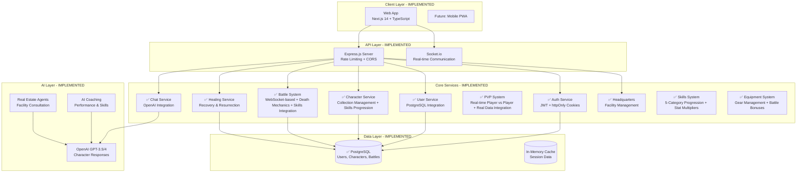

# Blank Wars - Current Architecture Overview (Updated)

## Date: July 19, 2025
## Status: Reflects implemented features and current system state

---

## 1. System Architecture Overview



---

## 2. Implemented Frontend Architecture

### Current Web Application Structure
```typescript
// ✅ IMPLEMENTED - Tech Stack
{
  framework: "Next.js 14 (App Router)",
  styling: "Tailwind CSS + Framer Motion",
  state: "React Context + useState/useEffect",
  realtime: "Socket.io Client",
  authentication: "httpOnly Cookies + JWT",
  deployment: "Vercel"
}

// ✅ IMPLEMENTED - Current Route Structure
/app
├── page.tsx                    // Main game dashboard
├── coach/page.tsx             // Coach progression system
├── game/page.tsx              // Battle arena
├── test-chat/page.tsx         // Chat testing
├── test-facilities/page.tsx   // HQ facilities testing
└── debug-test/page.tsx        // Development testing
```

### Main Tab System (Core UI)
```typescript
// ✅ IMPLEMENTED - Main Navigation Tabs
const implementedTabs = {
  coach: {
    subTabs: [
      "front-office",      // ✅ Coach progression dashboard
      "team-dashboard",    // ✅ Team stats overview
      "performance-coaching", // ✅ 1-on-1 combat training
      "individual-sessions",  // ✅ Personal life coaching
      "financial-advisory",   // ✅ Financial management
      "therapy",             // ✅ Character therapy sessions
      "group-events"         // ✅ Team building activities
    ]
  },
  
  characters: {
    subTabs: [
      "progression",    // ✅ Character leveling & stats + 5-category skills
      "equipment",      // ✅ Weapons & armor + AI advisor + battle bonuses
      "abilities"       // ✅ Skills & abilities + AI coach + stat multipliers
    ]
  },
  
  headquarters: {
    subTabs: [
      "overview"        // ✅ Team base + facility management
    ]
  },
  
  training: {
    subTabs: [
      "activities",     // ✅ Daily training sessions
      "progress",       // ✅ Training progress tracking
      "membership"      // ✅ Training tier subscriptions
    ]
  },
  
  battle: {
    subTabs: [
      "team-arena",     // ✅ 3v3 combat system + skills integration + real data
      "gameplan",       // ✅ Strategy tracking
      "teams",          // ✅ Team building + character health validation
      "packs"           // ✅ Character pack opening
    ]
  },
  
  social: {
    subTabs: [
      "clubhouse"       // ✅ Community features
    ]
  },
  
  store: {
    subTabs: [
      "merch"           // ✅ Merchandise purchasing
    ]
  }
};
```

---

## 3. Death/Recovery System Implementation (NEW)

### Character Health & Death Mechanics
```typescript
// ✅ IMPLEMENTED - Death/Recovery System
{
  deathMechanics: {
    healthStates: ["healthy", "light", "moderate", "severe", "critical", "dead"],
    deathPenalties: ["XP loss", "Level loss", "Progressive wait times"],
    trueDeathChance: "Based on battle outcome & health remaining"
  },
  
  recoveryOptions: {
    natural: "Time-based healing (free)",
    currency: "Accelerated healing (game currency)",
    premium: "Instant healing (premium currency)", 
    facilities: "Healing centers unlocked via HQ progression"
  },
  
  resurrectionSystem: {
    penalties: ["Level reduction", "XP loss", "Increasing wait times"],
    costs: "Scale with character level & rarity",
    restrictions: "Cannot resurrect during active battles"
  }
}

// Database Schema Extensions
CREATE TABLE healing_facilities (
  id TEXT PRIMARY KEY,
  name TEXT NOT NULL,
  facility_type TEXT CHECK (facility_type IN ('basic_medical', 'advanced_medical', 'premium_medical', 'resurrection_chamber')),
  healing_rate_multiplier DECIMAL(3,2) DEFAULT 1.0,
  currency_cost_per_hour INTEGER DEFAULT 0,
  premium_cost_per_hour INTEGER DEFAULT 0,
  max_injury_severity TEXT CHECK (max_injury_severity IN ('light', 'moderate', 'severe', 'critical', 'dead')),
  headquarters_tier_required TEXT,
  description TEXT
);

CREATE TABLE character_healing_sessions (
  id TEXT PRIMARY KEY,
  character_id TEXT NOT NULL REFERENCES user_characters(id),
  facility_id TEXT NOT NULL REFERENCES healing_facilities(id),
  session_type TEXT CHECK (session_type IN ('injury_healing', 'resurrection')),
  start_time TIMESTAMP DEFAULT CURRENT_TIMESTAMP,
  estimated_completion_time TIMESTAMP NOT NULL,
  currency_paid INTEGER DEFAULT 0,
  premium_paid INTEGER DEFAULT 0,
  is_active BOOLEAN DEFAULT TRUE
);
```

### API Endpoints Added
```typescript
// ✅ IMPLEMENTED - Healing/Resurrection Routes
const healingEndpoints = {
  "GET /api/healing/options/:characterId": "Available healing options for character",
  "POST /api/healing/start/:characterId": "Start healing session with selected facility",
  "GET /api/healing/sessions": "List active healing sessions for user",
  "GET /api/healing/resurrection/options/:characterId": "Resurrection options for dead character",
  "POST /api/healing/resurrection/:characterId": "Resurrect character with penalties",
  "GET /api/healing/character-status/:characterId": "Current health/death status"
};
```

### Battle System Integration
- **True Death Mechanics**: Characters can permanently die in battle
- **Progressive Injury System**: 5-tier injury severity system
- **Strategic Resource Management**: Healing costs scale with character value
- **Real Stakes**: Every battle matters due to permanent consequences

---

## 4. Unified Battle System Implementation (ENHANCED - July 20, 2025)

### Coach vs Coach Team Combat (Unified PvE/PvP)
```typescript
// ✅ IMPLEMENTED - Unified Battle System
{
  gameModel: {
    playerRole: "Coaches manage AI character teams",
    battleFormat: "3v3 team combat for both PvE and PvP",
    characterBehavior: "AI characters fight based on coach strategies and personalities",
    psychologySystem: "Characters can deviate from coach orders"
  },
  
  battleModes: {
    singlePlayer: "Coach vs AI coach (existing PvE functionality)",
    multiplayer: "Coach vs human coach (real-time team battles)",
    modeSelection: "Dynamic UI with '1 Player' and 'Multiplayer' buttons",
    unifiedInterface: "Single battle arena handles both modes"
  },
  
  healthSystem: {
    characterSelection: "Health status indicators (healthy/injured/dead)",
    eligibilityChecking: "Only healthy characters can participate",
    healingIntegration: "Direct links to healing facilities",
    visualFeedback: "Color-coded character states and eligibility",
    realTimeValidation: "Live character health checking"
  },
  
  technicalImplementation: {
    unifiedComponent: "ImprovedBattleArena.tsx handles both PvE and PvP",
    webSocketIntegration: "Real-time multiplayer for coach vs coach battles",
    healthService: "CharacterHealthService for eligibility validation",
    navigation: "Single Battle Arena tab with mode selection",
    realDataIntegration: "Characters created from actual match data and user rosters",
    demoRemoval: "All demo dependencies removed - uses only real character data"
  }
}

// New PVP-specific WebSocket Events
const pvpEvents = {
  "find_match": "Join matchmaking queue with character selection",
  "join_battle": "Connect to specific battle instance", 
  "select_strategy": "Choose combat approach during strategy phase",
  "battle_state_update": "Real-time battle progression updates"
};

// Character Health Service Integration
const healthValidation = {
  "GET /api/healing/character-status/:id": "Real-time health check",
  eligibilityChecking: "Prevents dead/injured characters from entering PVP",
  visualIndicators: "Heart (healthy), AlertTriangle (injured), Skull (dead)",
  healingRedirection: "Links to healing facilities for ineligible characters"
};
```

### PVP UI Components
- **PvPBattleArena.tsx**: Main PVP interface with health-aware character selection
- **CharacterHealthService.ts**: Real-time health validation service
- **MainTabSystem.tsx**: Battle → PvP Arena navigation integration

### Strategic Integration with Death/Recovery System
- **Character Eligibility**: Only healthy characters can participate in PVP
- **Real Stakes**: PVP battles can result in character death/injury
- **Resource Management**: Players must manage character health between battles
- **Strategic Decisions**: Healing costs vs PVP participation timing

### Real Data Integration (CRITICAL FIX - July 20, 2025)
- **Demo Dependencies Removed**: All `createDemoPlayerTeam`, `createDemoOpponentTeam`, `createDemoCharacterCollection` references eliminated
- **Real Character Data**: Battle system now uses only actual user characters and match data from WebSocket
- **Interface Compliance**: All character creation functions (`createCharacterFromMatchData`, `createOpponentTeamFromMatch`) comply with TeamCharacter interface
- **Error Handling**: Proper fallbacks when match data incomplete (returns empty team vs demo data)
- **Stat Cap Removal**: All Math.min() artificial limits removed from useMatchmaking.ts, progressionIntegration.ts, and character creation

### Files Modified for Real Data Integration
```typescript
// CLEANED FILES - Demo Dependencies Removed
{
  "ImprovedBattleArena.tsx": [
    "Removed createDemoCharacterCollection import",
    "Removed createDemoPlayerTeam, createDemoPlayerTeamWithBonuses, createDemoOpponentTeam imports", 
    "Replaced demo fallback logic with proper error handling",
    "Removed auto-select demo opponent logic",
    "Fixed opponent creation to use only real match data"
  ],
  
  "useMatchmaking.ts": "Removed Math.min(100, ...) caps from stat calculations",
  "progressionIntegration.ts": "Removed artificial stat caps from progression system",
  "teamBattleSystem.ts": "Set skill maxLevel to 999 instead of 10 for infinite scaling"
}
```

---

## 5. Character Progression System Implementation (ENHANCED - July 20, 2025)

### Enhanced Character Development
```typescript
// ✅ IMPLEMENTED - Multi-Dimensional Character Growth
{
  progressionSystems: {
    traditionalStats: {
      baseStats: ["strength", "speed", "dexterity", "vitality", "stamina", "intelligence", "charisma", "spirit"],
      scaling: "Infinite progression - no artificial caps removed",
      sources: ["Base character + Equipment bonuses + Skill multipliers"]
    },
    
    skillProgression: {
      categories: 5,
      maxLevel: 999,
      experienceSources: ["Battle performance", "Training activities", "Special events"],
      statMultipliers: "Applied to traditional stats in battle calculations"
    },
    
    equipmentProgression: {
      slots: ["weapon", "armor", "accessory"],
      bonusIntegration: "Direct stat bonuses + special effects",
      battleIntegration: "Combined with skills for final effective stats"
    }
  },
  
  characterInterface: {
    coreSkills: "5-category skill system with experience tracking",
    equippedItems: "Equipment slot management",
    equipmentBonuses: "Calculated stat bonuses from gear",
    healthStatus: "Injury/death state for battle eligibility"
  }
}
```

### Infinite Scaling Architecture
- **No Stat Caps**: All Math.min() limitations removed from progression calculations
- **Compound Growth**: Skills + Equipment + Base Stats = exponential character power
- **Strategic Builds**: Different skill/equipment combinations create unique archetypes
- **High-Level Content**: System designed for characters exceeding 200+ stats

---

## 6. Equipment System Integration (ENHANCED - July 20, 2025)

### Equipment Battle Integration
```typescript
// ✅ IMPLEMENTED - Full Equipment-to-Battle Pipeline
{
  equipmentFlow: {
    1: "Character equips items in equipment tab",
    2: "Equipment bonuses calculated and stored",
    3: "Battle system loads equipped items",
    4: "Bonuses applied alongside skill multipliers",
    5: "Final effective stats used in combat"
  },
  
  equipmentTypes: {
    weapons: "Offensive stat bonuses + special combat effects",
    armor: "Defensive stat bonuses + damage resistance",
    accessories: "Utility bonuses + unique passive abilities"
  },
  
  battleCharacterConversion: {
    file: "battleCharacterUtils.ts",
    function: "convertToBattleCharacter()",
    integration: "Seamlessly converts TeamCharacter with equipment to BattleCharacter format"
  }
}
```

### Equipment + Skills Synergy
- **Multiplicative Effects**: Equipment bonuses enhanced by skill multipliers
- **Build Diversity**: Different equipment/skill combinations for specialized roles
- **Strategic Depth**: Gear choices matter based on character's skill development
- **Power Scaling**: High-level characters with optimized gear become extremely powerful

---

## 7. Skills System Implementation (NEW - July 20, 2025)

### Core Skills Architecture
```typescript
// ✅ IMPLEMENTED - 5-Category Skills System
{
  skillCategories: {
    combat: {
      enhances: ["strength", "speed", "dexterity"],
      multiplier: "2% per level",
      battleImpact: "Physical damage and accuracy"
    },
    survival: {
      enhances: ["vitality", "stamina"], 
      multiplier: "2% per level",
      battleImpact: "Health and endurance"
    },
    mental: {
      enhances: ["intelligence"],
      multiplier: "1.5% per level", 
      battleImpact: "Strategy and special abilities"
    },
    social: {
      enhances: ["charisma", "team chemistry"],
      multiplier: "1% per level + team bonus",
      battleImpact: "Team coordination (+0.5 chemistry per avg social level)"
    },
    spiritual: {
      enhances: ["spirit"],
      multiplier: "1.5% per level",
      battleImpact: "Resistance and recovery"
    }
  },
  
  progressionSystem: {
    maxLevel: 999,
    scaling: "Infinite progression - no artificial caps",
    integration: "Skills + Equipment + Base Stats = Final Battle Stats"
  }
}

// TeamCharacter Interface Enhancement
interface TeamCharacter {
  // ... existing fields
  coreSkills: {
    combat: { level: number; experience: number; maxLevel: number; };
    survival: { level: number; experience: number; maxLevel: number; };
    mental: { level: number; experience: number; maxLevel: number; };
    social: { level: number; experience: number; maxLevel: number; };
    spiritual: { level: number; experience: number; maxLevel: number; };
  };
  equippedItems: {
    weapon?: Equipment;
    armor?: Equipment;
    accessory?: Equipment;
  };
  equipmentBonuses: EquipmentStats;
}
```

### Battle Integration
```typescript
// ✅ IMPLEMENTED - Stat Calculation Flow
const battleFlow = {
  1: "Load base character stats",
  2: "Apply equipment bonuses",
  3: "Calculate skill multipliers",
  4: "Apply temporary coaching bonuses", 
  5: "Generate final effective stats for battle",
  
  skillMultipliers: "calculateSkillMultipliers(character.coreSkills)",
  finalStats: "getEffectiveStats(character, tempModifiers)",
  teamChemistry: "Enhanced by average team social skill level"
};
```

### Demo Dependency Removal
- **✅ Complete**: All demo character dependencies removed from battle system
- **✅ Real Data Only**: Characters created from actual match data and user rosters
- **✅ Interface Compliance**: All character creation functions match TeamCharacter interface
- **✅ Error Handling**: Proper fallbacks when match data incomplete

### Infinite Scaling Architecture
- **No Stat Caps**: Math.min() limits removed from all progression systems
- **Skill Synergy**: Multiple skills can enhance the same stat for compound growth
- **High-Level Content Ready**: System designed for characters with 200+ stats
- **Strategic Depth**: Different skill builds create unique character archetypes

---

*This document reflects the actual implemented state as of July 20, 2025. The project has moved from architectural planning to a functional, deployable application with core features working.*

*Latest Update: Complete skills system implementation with 5-category skill progression, infinite scaling, equipment integration, and demo dependency removal. PVP system now uses only real character data with meaningful skill-based combat enhancement.*