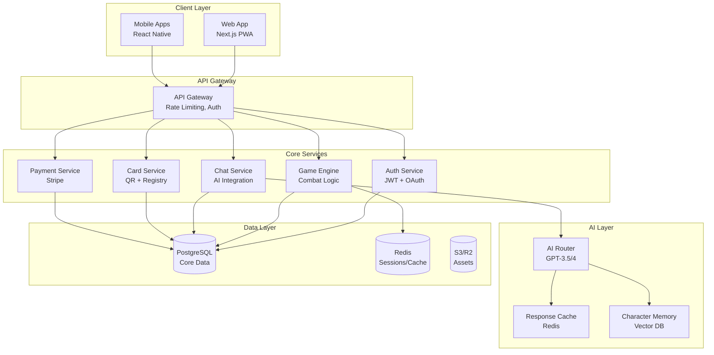

# Blank Wars - Comprehensive Architectural Overview
©WiseSage.ai


This document consolidates the architectural blueprint and technical architecture details for the Blank Wars project.

## 1. System Architecture Overview



## 2. Frontend Architecture

### Web Application (Primary Platform)
```javascript
// Tech Stack
{
  framework: "Next.js 14 (App Router)",
  styling: "Tailwind CSS + Framer Motion",
  state: "Zustand + React Query",
  realtime: "Socket.io Client",
  pwa: "next-pwa",
  analytics: "Mixpanel + Vercel Analytics"
}

// Core Routes Structure
/app
├── (auth)
│   ├── login/page.tsx
│   ├── register/page.tsx
│   └── oauth/callback/page.tsx
├── (game)
│   ├── battle/[id]/page.tsx
│   ├── collection/page.tsx
│   ├── chat/[characterId]/page.tsx
│   └── waiting-room/page.tsx
├── (shop)
│   ├── packs/page.tsx
│   ├── redeem/page.tsx
│   └── checkout/page.tsx
├── (social)
│   ├── leaderboard/page.tsx
│   ├── tournaments/page.tsx
│   └── profile/[username]/page.tsx
└── api/
    └── [...routes]
```

### Progressive Web App Features
```javascript
// PWA Manifest
{
  name: "Blank Wars",
  short_name: "BlankWars",
  description: "Battle & bond with legendary warriors",
  start_url: "/",
  display: "standalone",
  orientation: "portrait",
  theme_color: "#4CAF50",
  background_color: "#1a1a2e",
  icons: [/* multiple sizes */],
  
  // Key PWA Features
  features: {
    offline: "Service worker for offline battles",
    install: "Add to home screen prompts",
    notifications: "Character ready! Battle awaits!",
    background_sync: "Sync battles when online"
  }
}
```

## 3. Backend Services

### Microservices Architecture
```typescript
// 1. Authentication Service
class AuthService {
  endpoints = {
    POST   /auth/register
    POST   /auth/login
    POST   /auth/refresh
    POST   /auth/logout
    GET    /auth/me
    POST   /auth/oauth/google
    POST   /auth/oauth/apple
  }
  
  features = {
    jwt: "Access + Refresh tokens",
    oauth: "Google, Apple, Discord",
    mfa: "Optional 2FA for high-value accounts",
    sessions: "Redis session management"
  }
}

// 2. Game Engine Service
class GameEngineService {
  endpoints = {
    POST   /game/battle/start
    POST   /game/battle/:id/round
    GET    /game/battle/:id/state
    POST   /game/battle/:id/strategy
    POST   /game/battle/:id/end
    GET    /game/matchmaking/find
    POST   /game/character/:id/heal
    POST   /game/character/:id/train
  }
  
  combatEngine = {
    turnResolution: "Speed-based initiative",
    damageCalc: "ATK vs DEF with RNG variance",
    abilities: "Cooldowns, effects, combos",
    aiReferee: "Creative action resolution"
  }
}

// 3. Chat Service (The Magic ✨)
class ChatService {
  endpoints = {
    POST   /chat/:characterId/message
    GET    /chat/:characterId/history
    POST   /chat/:characterId/voice (premium)
    GET    /chat/:characterId/memories
    POST   /chat/:characterId/reset
  }
  
  features = {
    streaming: "Real-time response streaming",
    memory: "Vector DB for conversation history",
    personality: "Character-specific prompts",
    moderation: "Content filtering",
    rateLimit: "Per-user API quotas"
  }
}

// 4. Card Registry Service
class CardService {
  endpoints = {
    POST   /cards/pack/open
    POST   /cards/redeem/qr
    GET    /cards/collection/:userId
    POST   /cards/trade/offer
    GET    /cards/market/listings
    POST   /cards/generate/batch (admin)
  }
  
  security = {
    qrValidation: "Cryptographic signatures",
    oneTimeUse: "Prevent duplicate redemptions",
    antiTampering: "Server-side validation"
  }
}

// 5. Payment Service
class PaymentService {
  endpoints = {
    POST   /payment/checkout/session
    POST   /payment/webhook/stripe
    GET    /payment/subscription/status
    POST   /payment/subscription/cancel
    GET    /payment/history
  }
  
  products = {
    premium: "$4.99/month subscription",
    packs: "Digital ($2.99-5.99)",
    currency: "Gems for microtransactions",
    battlePass: "$9.99/season"
  }
}
```

## 4. Database Design

### PostgreSQL Schema
```sql
-- Core User System
CREATE TABLE users (
    id UUID PRIMARY KEY DEFAULT gen_random_uuid(),
    username VARCHAR(30) UNIQUE NOT NULL,
    email VARCHAR(255) UNIQUE NOT NULL,
    password_hash VARCHAR(255),
    oauth_provider VARCHAR(20),
    oauth_id VARCHAR(255),
    subscription_tier ENUM('free', 'premium', 'legendary') DEFAULT 'free',
    subscription_expires_at TIMESTAMP,
    daily_play_seconds INTEGER DEFAULT 0,
    last_play_reset TIMESTAMP DEFAULT CURRENT_TIMESTAMP,
    created_at TIMESTAMP DEFAULT CURRENT_TIMESTAMP,
    updated_at TIMESTAMP DEFAULT CURRENT_TIMESTAMP,
    
    INDEX idx_username (username),
    INDEX idx_email (email)
);

-- Character Registry (All possible characters)
CREATE TABLE characters (
    id UUID PRIMARY KEY DEFAULT gen_random_uuid(),
    name VARCHAR(100) NOT NULL,
    title VARCHAR(200),
    archetype ENUM('warrior', 'mage', 'trickster', 'leader', 'scholar', 'beast'),
    origin_era VARCHAR(100), -- "Ancient Greece", "Cyberpunk 2150", etc.
    rarity ENUM('common', 'uncommon', 'rare', 'epic', 'legendary', 'mythic'),
    
    -- Base Stats
    base_health INTEGER NOT NULL,
    base_attack INTEGER NOT NULL,
    base_defense INTEGER NOT NULL,
    base_speed INTEGER NOT NULL,
    base_special INTEGER NOT NULL,
    
    -- AI Personality
    personality_traits JSONB NOT NULL, -- ["brave", "cunning", "loyal"]
    conversation_style VARCHAR(50), -- "formal_ancient", "casual_modern"
    voice_profile VARCHAR(50), -- For future voice synthesis
    backstory TEXT,
    conversation_topics JSONB, -- ["Troy", "Honor", "Family"]
    
    -- Visual
    avatar_emoji VARCHAR(10), -- For quick display
    artwork_url VARCHAR(500),
    
    -- Abilities
    abilities JSONB NOT NULL, -- [{name, description, damage, cooldown}]
    
    created_at TIMESTAMP DEFAULT CURRENT_TIMESTAMP,
    INDEX idx_rarity (rarity),
    INDEX idx_archetype (archetype)
);

-- User's Character Collection
CREATE TABLE user_characters (
    id UUID PRIMARY KEY DEFAULT gen_random_uuid(),
    user_id UUID NOT NULL REFERENCES users(id) ON DELETE CASCADE,
    character_id UUID NOT NULL REFERENCES characters(id),
    serial_number VARCHAR(20) UNIQUE, -- For physical cards
    nickname VARCHAR(50),
    
    -- Progression
    level INTEGER DEFAULT 1,
    experience INTEGER DEFAULT 0,
    bond_level INTEGER DEFAULT 0,
    total_battles INTEGER DEFAULT 0,
    total_wins INTEGER DEFAULT 0,
    
    -- Current State
    current_health INTEGER NOT NULL,
    max_health INTEGER NOT NULL,
    is_injured BOOLEAN DEFAULT false,
    recovery_time TIMESTAMP,
    
    -- Customization
    equipment JSONB DEFAULT '[]',
    enhancements JSONB DEFAULT '[]',
    skin_id VARCHAR(50),
    
    -- AI Memory
    conversation_memory JSONB DEFAULT '[]', -- Last 50 exchanges
    significant_memories JSONB DEFAULT '[]', -- Important moments
    personality_drift JSONB DEFAULT '{}', -- How character evolved
    
    acquired_at TIMESTAMP DEFAULT CURRENT_TIMESTAMP,
    last_battle_at TIMESTAMP,
    
    INDEX idx_user_characters (user_id),
    INDEX idx_serial (serial_number),
    UNIQUE(user_id, character_id, serial_number)
);

-- Battle System
CREATE TABLE battles (
    id UUID PRIMARY KEY DEFAULT gen_random_uuid(),
    player1_id UUID NOT NULL REFERENCES users(id),
    player2_id UUID NOT NULL REFERENCES users(id),
    character1_id UUID NOT NULL REFERENCES user_characters(id),
    character2_id UUID NOT NULL REFERENCES user_characters(id),
    
    -- Battle State
    status ENUM('matchmaking', 'active', 'paused', 'completed') DEFAULT 'matchmaking',
    current_round INTEGER DEFAULT 1,
    turn_count INTEGER DEFAULT 0,
    
    -- Strategy Selections
    p1_strategy ENUM('aggressive', 'defensive', 'balanced'),
    p2_strategy ENUM('aggressive', 'defensive', 'balanced'),
    
    -- Results
    winner_id UUID REFERENCES users(id),
    end_reason VARCHAR(50), -- 'knockout', 'rounds_complete', 'forfeit'
    
    -- Logs
    combat_log JSONB DEFAULT '[]',
    chat_logs JSONB DEFAULT '[]',
    
    -- Rewards
    xp_gained INTEGER DEFAULT 0,
    bond_gained INTEGER DEFAULT 0,
    currency_gained INTEGER DEFAULT 0,
    
    started_at TIMESTAMP DEFAULT CURRENT_TIMESTAMP,
    ended_at TIMESTAMP,
    
    INDEX idx_active_battles (status) WHERE status = 'active',
    INDEX idx_player_battles (player1_id, player2_id)
);

-- Chat Conversations
CREATE TABLE chat_messages (
    id UUID PRIMARY KEY DEFAULT gen_random_uuid(),
    user_id UUID NOT NULL REFERENCES users(id),
    character_id UUID NOT NULL REFERENCES user_characters(id),
    battle_id UUID REFERENCES battles(id),
    
    -- Message Content
    player_message TEXT NOT NULL,
    character_response TEXT NOT NULL,
    
    -- Context
    message_context JSONB, -- {round, health, mood, etc}
    
    -- AI Metrics
    model_used VARCHAR(50),
    tokens_used INTEGER,
    response_time_ms INTEGER,
    
    -- Bonding
    bond_increase BOOLEAN DEFAULT false,
    memory_saved BOOLEAN DEFAULT false,
    
    created_at TIMESTAMP DEFAULT CURRENT_TIMESTAMP,
    
    INDEX idx_user_chats (user_id, character_id),
    INDEX idx_recent_chats (created_at DESC)
);

-- Card Packs & Redemption
CREATE TABLE card_packs (
    id UUID PRIMARY KEY DEFAULT gen_random_uuid(),
    pack_type VARCHAR(50) NOT NULL, -- 'starter', 'premium', 'legendary'
    pack_series VARCHAR(50), -- 'genesis', 'mythology_vol1'
    price_usd DECIMAL(10,2),
    cards_count INTEGER NOT NULL,
    guaranteed_rarity VARCHAR(20),
    created_at TIMESTAMP DEFAULT CURRENT_TIMESTAMP
);

CREATE TABLE qr_codes (
    id UUID PRIMARY KEY DEFAULT gen_random_uuid(),
    serial_number VARCHAR(20) UNIQUE NOT NULL,
    character_id UUID NOT NULL REFERENCES characters(id),
    pack_id UUID REFERENCES card_packs(id),
    
    -- Security
    signature VARCHAR(255) NOT NULL,
    batch_id VARCHAR(50),
    
    -- Redemption
    is_redeemed BOOLEAN DEFAULT false,
    redeemed_by UUID REFERENCES users(id),
    redeemed_at TIMESTAMP,
    
    created_at TIMESTAMP DEFAULT CURRENT_TIMESTAMP,
    
    INDEX idx_unredeemed (is_redeemed) WHERE is_redeemed = false,
    INDEX idx_serial_lookup (serial_number)
);

-- Tournament System
CREATE TABLE tournaments (
    id UUID PRIMARY KEY DEFAULT gen_random_uuid(),
    name VARCHAR(200) NOT NULL,
    description TEXT,
    
    -- Rules
    format VARCHAR(50), -- 'single_elimination', 'swiss'
    character_restrictions JSONB, -- {rarity_max: 'epic', banned: []}
    entry_fee INTEGER DEFAULT 0,
    prize_pool JSONB,
    
    -- Schedule
    registration_starts TIMESTAMP,
    registration_ends TIMESTAMP,
    tournament_starts TIMESTAMP,
    
    -- State
    status ENUM('upcoming', 'registration', 'active', 'completed'),
    current_round INTEGER DEFAULT 0,
    participants JSONB DEFAULT '[]',
    brackets JSONB,
    
    created_at TIMESTAMP DEFAULT CURRENT_TIMESTAMP,
    
    INDEX idx_tournament_status (status)
);

-- Analytics Events
CREATE TABLE analytics_events (
    id UUID PRIMARY KEY DEFAULT gen_random_uuid(),
    user_id UUID REFERENCES users(id),
    event_type VARCHAR(50) NOT NULL,
    event_data JSONB,
    
    -- Context
    session_id VARCHAR(100),
    platform VARCHAR(20),
    version VARCHAR(20),
    
    created_at TIMESTAMP DEFAULT CURRENT_TIMESTAMP,
    
    INDEX idx_user_events (user_id, created_at),
    INDEX idx_event_types (event_type, created_at)
) PARTITION BY RANGE (created_at);

-- Create monthly partitions for analytics
CREATE TABLE analytics_events_2024_11 PARTITION OF analytics_events
    FOR VALUES FROM ('2024-11-01') TO ('2024-12-01');
```

## 5. AI Chat System

### Architecture for Scale & Economics
```typescript
// AI Chat Service Architecture
class AIChatSystem {
  // 1. Request Router
  async routeMessage(userId: string, characterId: string, message: string) {
    const user = await getUser(userId);
    const character = await getCharacter(characterId);
    
    // Route based on user tier and context
    if (user.tier === 'free' && this.canUseTemplate(message)) {
      return this.templateResponse(message, character);
    } else if (user.tier === 'free' && user.dailyAIChats < 50) {
      return this.economicalAI(message, character);
    } else if (user.tier === 'premium') {
      return this.premiumAI(message, character);
    }
  }
  
  // 2. Template System (Free Tier)
  templateResponses = {
    patterns: [
      {
        match: /how are you|feeling/i,
        responses: {
          warrior: ["Battle-ready as always!", "My blade thirsts for combat!"],
          mage: ["The arcane energies flow strong!", "Magic courses through me!"],
          trickster: ["Mischievous as ever!", "Ready to cause some chaos!"]
        }
      },
      // 100+ patterns covering 80% of conversations
    ]
  };
  
  // 3. Economical AI (GPT-3.5 Turbo)
  async economicalAI(message: string, character: Character) {
    const prompt = this.buildEconomicalPrompt(character, message);
    
    return await openai.createChatCompletion({
      model: "gpt-3.5-turbo",
      messages: [
        { role: "system", content: prompt },
        { role: "user", content: message }
      ],
      max_tokens: 60,
      temperature: 0.8,
      presence_penalty: 0.6, // Encourage variety
    });
  }
  
  // 4. Premium AI (GPT-4 or Claude)
  async premiumAI(message: string, character: Character) {
    const context = await this.loadCharacterMemory(character.id);
    const prompt = this.buildPremiumPrompt(character, context);
    
    return await anthropic.messages.create({
      model: "claude-3-sonnet",
      messages: [
        { role: "system", content: prompt },
        ...context.recentMessages,
        { role: "user", content: message }
      ],
      max_tokens: 150
    });
  }
  
  // 5. Character Memory System
  memory = {
    shortTerm: new Map(), // Last 10 messages in Redis
    longTerm: {}, // Vector DB for semantic search
    significant: {} // Key moments stored permanently
  };
  
  // 6. Response Caching
  cache = {
    ttl: 3600, // 1 hour
    key: (charId, msgHash) => `chat:${charId}:${msgHash}`,
    similarity: 0.85 // Threshold for "similar enough" messages
  };
}

// Prompt Engineering
class PromptBuilder {
  buildEconomicalPrompt(character: Character, battleContext?: BattleContext) {
    return `You are ${character.name}, ${character.title}.
Origin: ${character.origin}
Personality: ${character.traits.join(', ')}
Speaking style: ${character.style}

Current situation: ${battleContext ? `Round ${battleContext.round}, Health: ${battleContext.health}%` : 'Chatting between battles'}

CRITICAL: Respond in character in 40 words or less. Be conversational and emotional.`
  }
  
  buildPremiumPrompt(character: Character, memory: Memory) {
    return `${this.buildEconomicalPrompt(character)}
    
Bond Level: ${memory.bondLevel}/10
Recent topics: ${memory.recentTopics.join(', ')}
Relationship notes: ${memory.relationshipSummary}

You remember past conversations and reference them naturally. Show emotional depth and character growth.`
  }
}
```

### Cost Optimization Strategies
```javascript
// Smart API Usage Patterns
const costOptimization = {
  // 1. Message Classification
  classifyMessage: (msg) => {
    if (COMMON_PATTERNS.some(p => p.test(msg))) return 'template';
    if (msg.length < 20 && SIMPLE_QUERIES.includes(msg)) return 'simple';
    return 'complex';
  },
  
  // 2. Batching for Non-Urgent Responses
  batchQueue: [],
  processBatch: async () => {
    if (batchQueue.length >= 10) {
      // Process multiple messages in one API call
      const responses = await batchAPICall(batchQueue);
      batchQueue = [];
    }
  },
  
  // 3. Progressive Enhancement
  userProgression: {
    bondLevel_0_2: { aiUsage: '20%', templates: '80%' },
    bondLevel_3_5: { aiUsage: '50%', templates: '50%' },
    bondLevel_6_10: { aiUsage: '100%', templates: '0%' }
  }
};
```

## 6. Game Mechanics Engine

### Combat System
```typescript
class CombatEngine {
  // Core Combat Loop
  async executeRound(battle: Battle) {
    // 1. Apply strategy modifiers
    const p1Mods = this.getStrategyModifiers(battle.p1Strategy);
    const p2Mods = this.getStrategyModifiers(battle.p2Strategy);
    
    // 2. Determine turn order
    const turnOrder = this.calculateInitiative(
      battle.character1.speed * p1Mods.speedMod,
      battle.character2.speed * p2Mods.speedMod
    );
    
    // 3. Execute turns
    for (const attacker of turnOrder) {
      if (this.isBattleOver(battle)) break;
      
      const action = await this.determineAction(attacker, battle);
      const result = await this.resolveAction(action, battle);
      
      battle.combatLog.push(result);
      await this.updateBattleState(battle, result);
    }
    
    // 4. Check victory conditions
    return this.checkVictoryConditions(battle);
  }
  
  // Damage Calculation
  calculateDamage(attacker: Character, defender: Character, ability: Ability) {
    const baseDamage = attacker.attack * ability.powerMultiplier;
    const defense = defender.defense * (1 - ability.penetration);
    const variance = 0.85 + Math.random() * 0.3; // 85-115%
    
    let damage = Math.max(1, (baseDamage - defense) * variance);
    
    // Critical hits
    if (Math.random() < attacker.critChance) {
      damage *= 2;
      this.triggerEffect('critical');
    }
    
    // Elemental advantages
    damage *= this.getElementalMultiplier(ability.element, defender.element);
    
    return Math.round(damage);
  }
  
  // AI Decision Making
  async determineAction(character: Character, battle: Battle) {
    const ai = new CombatAI(character);
    
    // Analyze battle state
    const analysis = {
      myHealth: character.currentHealth / character.maxHealth,
      enemyHealth: battle.opponent.currentHealth / battle.opponent.maxHealth,
      cooldowns: character.abilities.map(a => a.currentCooldown),
      statuses: character.activeEffects
    };
    
    // Choose ability based on character archetype
    return ai.selectOptimalAction(analysis);
  }
}

// Status Effects System
class StatusEffectEngine {
  effects = {
    burn: {
      duration: 3,
      tickDamage: (caster) => caster.attack * 0.2,
      stackable: true
    },
    stun: {
      duration: 1,
      skipTurn: true,
      stackable: false
    },
    shield: {
      duration: 2,
      damageReduction: 0.5,
      stackable: false
    },
    rage: {
      duration: 3,
      statModifier: { attack: 1.5, defense: 0.8 },
      stackable: false
    }
  };
  
  applyEffect(target: Character, effect: StatusEffect) {
    if (!effect.stackable && target.hasEffect(effect.name)) {
      // Refresh duration instead
      target.effects[effect.name].duration = effect.duration;
    } else {
      target.effects[effect.name] = { ...effect, remainingTurns: effect.duration };
    }
  }
}
```

## 7. Physical Card Integration

### QR Code System
```typescript
class QRCardSystem {
  // QR Code Generation (Backend)
  async generateCardBatch(packType: string, quantity: number) {
    const cards = [];
    
    for (let i = 0; i < quantity; i++) {
      const character = await this.selectCharacterByRarity(packType);
      const serial = this.generateSerial();
      
      const qrData = {
        s: serial, // serial
        c: character.id, // character ID
        p: packType, // pack type
        t: Date.now(), // timestamp
      };
      
      const signature = await this.signData(qrData);
      const qrCode = await QRCode.toDataURL(
        JSON.stringify({ ...qrData, sig: signature })
      );
      
      cards.push({
        serial,
        characterId: character.id,
        qrCode,
        signature
      });
    }
    
    return cards;
  }
  
  // QR Redemption Flow
  async redeemQRCode(userId: string, qrData: string) {
    try {
      const data = JSON.parse(qrData);
      
      // 1. Verify signature
      if (!await this.verifySignature(data)) {
        throw new Error('Invalid QR code');
      }
      
      // 2. Check if already redeemed
      const existing = await db.qrCodes.findOne({ serial: data.s });
      if (existing?.isRedeemed) {
        throw new Error('Card already redeemed');
      }
      
      // 3. Add to user's collection
      const character = await db.characters.findOne({ id: data.c });
      const userCharacter = await this.addToCollection(userId, character, data.s);
      
      // 4. Mark as redeemed
      await db.qrCodes.update({
        serial: data.s,
        isRedeemed: true,
        redeemedBy: userId,
        redeemedAt: new Date()
      });
      
      return {
        success: true,
        character: userCharacter,
        firstTime: true // Trigger special animation
      };
    } catch (error) {
      return { success: false, error: error.message };
    }
  }
  
  // Security
  signData(data: object): string {
    const payload = JSON.stringify(data);
    return crypto
      .createHmac('sha256', process.env.QR_SECRET)
      .update(payload)
      .digest('hex');
  }
}

// Physical Card Design Specs
const cardDesign = {
  dimensions: {
    width: "2.5 inches",
    height: "3.5 inches", // Standard trading card size
  },
  
  layout: {
    front: {
      artwork: "60% of card",
      nameBar: "Gothic font with foil effect",
      stats: "Bottom corners with icons",
      rarity: "Holographic indicator",
      qrCode: "Hidden under scratch-off foil"
    },
    
    back: {
      logo: "Blank Wars embossed logo",
      pattern: "Mystic swirl holographic",
      legal: "© 2024 Blank Wars, Serial: XXX"
    }
  },
  
  rarityIndicators: {
    common: "Standard print",
    uncommon: "Silver foil accents",
    rare: "Gold foil name and border",
    epic: "Full holographic overlay",
    legendary: "Textured + animated hologram",
    mythic: "Metal card with NFC chip"
  }
};
```

## 8. Monetization System

### Revenue Streams & Implementation
```typescript
class MonetizationEngine {
  // 1. Subscription Tiers
  subscriptions = {
    free: {
      price: 0,
      features: [
        "3 character slots",
        "30 min daily playtime",
        "Basic chat responses",
        "5 battles per day"
      ]
    },
    
    premium: {
      price: 4.99,
      features: [
        "Unlimited character slots",
        "Unlimited playtime",
        "Advanced AI chat",
        "All game modes",
        "2x XP and rewards",
        "Exclusive monthly character"
      ]
    },
    
    legendary: {
      price: 14.99,
      features: [
        "Everything in Premium",
        "Early access to new characters",
        "Legendary card pack monthly",
        "Custom character skins",
        "Tournament priority entry",
        "Voice chat with characters"
      ]
    }
  };
  
  // 2. In-App Purchases
  iap = {
    // Card Packs
    packs: {
      starter: { price: 2.99, cards: 5 },
      premium: { price: 5.99, cards: 8, guaranteedRare: true },
      legendary: { price: 12.99, cards: 10, guaranteedEpic: true }
    },
    
    // Currencies
    gems: {
      small: { price: 0.99, gems: 100 },
      medium: { price: 4.99, gems: 600 },
      large: { price: 9.99, gems: 1300 },
      mega: { price: 49.99, gems: 8000 }
    },
    
    // Consumables
    items: {
      instantHeal: { gems: 50 },
      xpBoost24h: { gems: 200 },
      characterSlot: { gems: 500 }
    }
  };
  
  // 3. Battle Pass System
  battlePass = {
    price: 9.99,
    duration: "3 months",
    tiers: 50,
    rewards: {
      free: "Every 5 tiers: pack, gems, or items",
      premium: "Every tier: exclusive content"
    }
  };
  
  // 4. Physical Products
  physical = {
    cardPacks: {
      retail: 4.99,
      wholesale: 2.50,
      distribution: "Target, GameStop, Amazon"
    },
    
    starterBox: {
      price: 24.99,
      contents: "2 packs + playmat + rulebook + promo"
    },
    
    collectorTins: {
      price: 19.99,
      contents: "3 packs + exclusive metal card"
    }
  };
}

// Payment Processing
class PaymentProcessor {
  // Stripe Integration
  async createCheckoutSession(userId: string, product: Product) {
    const session = await stripe.checkout.sessions.create({
      payment_method_types: ['card'],
      line_items: [{
        price_data: {
          currency: 'usd',
          product_data: {
            name: product.name,
            description: product.description,
          },
          unit_amount: product.price * 100,
        },
        quantity: 1,
      }],
      mode: product.recurring ? 'subscription' : 'payment',
      success_url: `${BASE_URL}/payment/success?session_id={CHECKOUT_SESSION_ID}`,
      cancel_url: `${BASE_URL}/payment/cancel`,
      metadata: {
        userId,
        productId: product.id
      }
    });
    
    return session;
  }
  
  // Webhook Handler
  async handleWebhook(event: StripeEvent) {
    switch (event.type) {
      case 'checkout.session.completed':
        await this.fulfillOrder(event.data.object);
        break;
      case 'invoice.payment_succeeded':
        await this.renewSubscription(event.data.object);
        break;
      case 'customer.subscription.deleted':
        await this.cancelSubscription(event.data.object);
        break;
    }
  }
}
```

## 9. Infrastructure & DevOps

### Deployment Architecture
```yaml
# docker-compose.yml (Development)
version: '3.8'

services:
  # Frontend
  web:
    build: ./apps/web
    ports:
      - "3000:3000"
    environment:
      - NEXT_PUBLIC_API_URL=http://localhost:4000
    
  # API Gateway
  api:
    build: ./apps/api
    ports:
      - "4000:4000"
    depends_on:
      - postgres
      - redis
    
  # Microservices
  auth-service:
    build: ./services/auth
    environment:
      - JWT_SECRET=${JWT_SECRET}
      
  game-service:
    build: ./services/game
    
  chat-service:
    build: ./services/chat
    environment:
      - OPENAI_API_KEY=${OPENAI_API_KEY}
      - ANTHROPIC_API_KEY=${ANTHROPIC_API_KEY}
    
  # Databases
  postgres:
    image: postgres:15
    environment:
      - POSTGRES_DB=blankwars
      - POSTGRES_USER=admin
      - POSTGRES_PASSWORD=${DB_PASSWORD}
    volumes:
      - postgres_data:/var/lib/postgresql/data
      
  redis:
    image: redis:7-alpine
    ports:
      - "6379:6379"
      
  # Monitoring
  prometheus:
    image: prom/prometheus
    
  grafana:
    image: grafana/grafana
    ports:
      - "3030:3000"

volumes:
  postgres_data:
```

### Production Infrastructure (AWS/GCP)
```typescript
// Infrastructure as Code (Terraform)
const infrastructure = {
  // Multi-Region Setup
  regions: {
    primary: "us-east-1",
    secondary: "eu-west-1",
    cdn: "CloudFront Global"
  },
  
  // Auto-Scaling Groups
  scaling: {
    web: {
      min: 2,
      max: 20,
      targetCPU: 70
    },
    api: {
      min: 3,
      max: 50,
      targetCPU: 60
    },
    chatService: {
      min: 5,
      max: 100, // AI is CPU intensive
      targetCPU: 50
    }
  },
  
  // Databases
  databases: {
    primary: "RDS PostgreSQL Multi-AZ",
    cache: "ElastiCache Redis Cluster",
    cdn: "CloudFront + S3 for assets"
  },
  
  // Monitoring
  monitoring: {
    apm: "DataDog",
    logs: "CloudWatch + ElasticSearch",
    alerts: "PagerDuty",
    analytics: "Mixpanel + BigQuery"
  }
};
```

### CI/CD Pipeline
```yaml
# .github/workflows/deploy.yml
name: Deploy to Production

on:
  push:
    branches: [main]

jobs:
  test:
    runs-on: ubuntu-latest
    steps:
      - uses: actions/checkout@v3
      - name: Run Tests
        run: |
          npm test
          npm run test:e2e
          
  deploy-web:
    needs: test
    runs-on: ubuntu-latest
    steps:
      - name: Deploy to Vercel
        run: vercel --prod
        
  deploy-api:
    needs: test
    runs-on: ubuntu-latest
    steps:
      - name: Build Docker Images
        run: |
          docker build -t blankwars/api .
          docker push blankwars/api
      
      - name: Deploy to ECS
        run: |
          aws ecs update-service \
            --cluster production \
            --service api \
            --force-new-deployment
```

## 10. Security Architecture

### Security Layers
```typescript
class SecurityFramework {
  // 1. Authentication & Authorization
  auth = {
    jwt: {
      accessToken: "15 minutes",
      refreshToken: "30 days",
      algorithm: "RS256"
    },
    
    rbac: {
      roles: ['user', 'premium', 'moderator', 'admin'],
      permissions: {
        user: ['play', 'chat', 'view_collection'],
        premium: ['...user', 'unlimited_play', 'premium_features'],
        moderator: ['...premium', 'ban_users', 'moderate_chat'],
        admin: ['*']
      }
    }
  };
  
  // 2. API Security
  apiSecurity = {
    rateLimiting: {
      global: "1000 req/hour",
      authenticated: "5000 req/hour",
      premium: "20000 req/hour"
    },
    
    ddosProtection: "Cloudflare",
    
    inputValidation: {
      library: "joi/zod",
      sanitization: "DOMPurify for user content"
    }
  };
  
  // 3. Data Protection
  dataProtection = {
    encryption: {
      atRest: "AES-256",
      inTransit: "TLS 1.3",
      passwords: "bcrypt (rounds: 12)"
    },
    
    pii: {
      storage: "Encrypted and separate DB",
      access: "Audit logged",
      retention: "As per GDPR/CCPA"
    }
  };
  
  // 4. Game-Specific Security
  gameSecurit = {
    antiCheat: {
      serverAuthoritative: true,
      clientValidation: "Checksum verification",
      behaviorAnalysis: "ML-based anomaly detection"
    },
    
    qrSecurity: {
      signature: "HMAC-SHA256",
      expiry: "Cards valid for 2 years",
      duplicationPrevention: "One-time redemption"
    }
  };
}

// Content Moderation
class ModerationSystem {
  // Chat filtering
  async moderateChat(message: string, userId: string) {
    // 1. Profanity filter
    if (await this.containsProfanity(message)) {
      return { blocked: true, reason: 'profanity' };
    }
    
    // 2. Personal info detection
    if (this.containsPII(message)) {
      return { blocked: true, reason: 'pii_detected' };
    }
    
    // 3. AI moderation for context
    const aiModeration = await openai.moderations.create({
      input: message
    });
    
    if (aiModeration.results[0].flagged) {
      return { blocked: true, reason: 'ai_flagged' };
    }
    
    return { blocked: false };
  }
}
```

## 11. Analytics & Monitoring

### Analytics Architecture
```typescript
class AnalyticsEngine {
  // 1. Player Analytics
  trackPlayerMetrics = {
    engagement: {
      dailyActiveUsers: "Unique logins per day",
      sessionLength: "Average play time",
      retentionRate: "D1, D7, D30 retention",
      churnPrediction: "ML model on behavior"
    },
    
    monetization: {
      arpu: "Average revenue per user",
      arppu: "Average revenue per paying user",
      conversionRate: "Free to paid %",
      ltv: "Lifetime value prediction"
    },
    
    gameplay: {
      popularCharacters: "Most played by tier",
      winRates: "By character and matchup",
      chatEngagement: "Messages per battle",
      bondLevels: "Average by playtime"
    }
  };
  
  // 2. System Metrics
  systemMetrics = {
    performance: {
      apiLatency: "p50, p95, p99",
      errorRates: "4xx, 5xx by endpoint",
      aiResponseTime: "Chat generation speed",
      databaseLoad: "Query performance"
    },
    
    costs: {
      aiApiUsage: "Tokens per user segment",
      infrastructureCosts: "Per user breakdown",
      supportTickets: "Volume and resolution time"
    }
  };
  
  // 3. Business Intelligence
  dashboards = {
    executive: {
      kpis: ["Revenue", "DAU", "Conversion", "Costs"],
      alerts: ["Revenue drop >10%", "Churn spike"]
    },
    
    product: {
      features: ["Feature adoption", "A/B test results"],
      userFlow: ["Funnel analysis", "Drop-off points"]
    },
    
    liveOps: {
      monitoring: ["Server health", "Active battles"],
      events: ["Tournament participation", "Pack sales"]
    }
  };
}

// Real-time Monitoring
class MonitoringSystem {
  // Health checks
  healthEndpoints = {
    "/health": "Basic liveness",
    "/health/ready": "Full system check",
    "/metrics": "Prometheus metrics"
  };
  
  // Alert Rules
  alerts = {
    critical: {
      apiDown: "Response time > 5s for 5 min",
      paymentFailures: "Failure rate > 5%",
      databaseConnection: "Connection pool exhausted"
    },
    
    warning: {
      highLatency: "p95 > 1s",
      aiCosts: "Hourly cost > $100",
      lowInventory: "Card pack stock < 1000"
    }
  };
}
```

## 12. Development Phases

### Phase 1: MVP (Week 1-2)
```typescript
const mvpFeatures = {
  core: [
    "Basic combat engine",
    "20 starter characters",
    "Simple AI chat (templates + GPT-3.5)",
    "User registration/login",
    "Web app deployment"
  ],
  
  target: "100 alpha testers",
  
  techStack: {
    frontend: "Next.js on Vercel",
    backend: "Node.js on Railway",
    database: "Supabase (Postgres + Auth)",
    ai: "OpenAI API"
  }
};
```

### Phase 2: Beta (Week 3-4)
```typescript
const betaFeatures = {
  additions: [
    "50 total characters",
    "QR code redemption",
    "Payment integration",
    "Premium subscriptions",
    "Basic tournaments"
  ],
  
  target: "1,000 beta users",
  
  infrastructure: {
    cdn: "Cloudflare for assets",
    monitoring: "Sentry + Mixpanel",
    scaling: "Basic auto-scaling"
  }
};
```

### Phase 3: Launch (Month 2)
```typescript
const launchFeatures = {
  complete: [
    "100+ characters",
    "Full AI chat system",
    "Physical card printing",
    "Battle pass",
    "Social features",
    "Mobile PWA"
  ],
  
  marketing: {
    strategy: "Influencer partnerships",
    budget: "$10,000",
    channels: ["TikTok", "YouTube", "Discord"]
  },
  
  target: "10,000 users first week"
};
```

### Phase 4: Scale (Month 3-6)
```typescript
const scaleStrategy = {
  features: [
    "Native mobile apps",
    "Voice chat with characters",
    "User-generated tournaments",
    "Character marketplace",
    "Clan/Guild system"
  ],
  
  expansion: {
    international: "Localize to 5 languages",
    platforms: "Steam, Epic Games",
    retail: "Physical distribution deals"
  },
  
  target: "1 million users",
  revenue: "$500k/month"
};
```

### Phase 5: Franchise (Year 2+)
```typescript
const franchiseVision = {
  products: [
    "Animated series on streaming",
    "Physical board game",
    "Comic book series",
    "Merchandise line"
  ],
  
  technology: [
    "Custom AI models",
    "AR card battles",
    "Blockchain trading",
    "Character NFTs"
  ],
  
  exit: {
    target: "$50-100M acquisition",
    buyers: ["Hasbro", "Pokemon Company", "Epic Games"]
  }
};
```

## Success Metrics & KPIs

### Key Success Indicators
```typescript
const successMetrics = {
  month1: {
    users: 10000,
    dau: 3000,
    conversion: "5%",
    revenue: "$5,000"
  },
  
  month3: {
    users: 100000,
    dau: 30000,
    conversion: "8%",
    revenue: "$50,000"
  },
  
  month6: {
    users: 500000,
    dau: 150000,
    conversion: "10%",
    revenue: "$250,000"
  },
  
  year1: {
    users: 2000000,
    dau: 500000,
    conversion: "12%",
    revenue: "$1M/month"
  }
};
```

## Next Steps

With this complete blueprint, we can now systematically build each component:

1.  **Start with Combat Engine** (Already prototyped!)
2.  **Add Basic Chat System** (Templates first, AI later)
3.  **Build User System** (Auth + Database)
4.  **Create Character Registry** (20 starters)
5.  **Implement Battles** (Matchmaking + Resolution)
6.  **Add Monetization** (Stripe integration)
7.  **Deploy MVP** (Vercel + Railway)
8.  **Iterate Based on Feedback**


